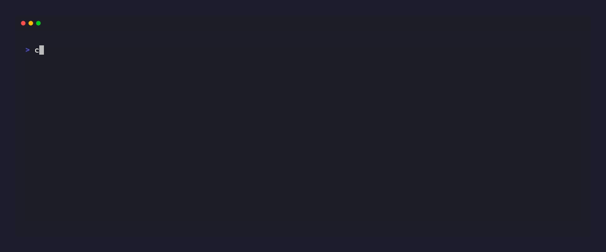

# scaffold-cli

🚀 A CLI tool written in Go to standardize project scaffolding, library creation, and internal
microservices using predefined templates and architectural patterns. Say goodbye to boilerplate!

[](LICENSE)

`scaffold-cli` is a universal, dynamically-extensible scaffolding engine. Scaffolds, versions,
dimensions, templates, selector values, and even the CLI flag names themselves are declared by
templates at runtime — none of it is hardcoded in the binary. The engine only knows how to walk an
inheritance chain and render; what gets generated comes entirely from a separate templates
repository (see [Requirements](#requirements) below).


## Features

- **Nothing hardcoded.** Scaffolds, versions, dimensions, templates, selector values, and even CLI
  flag names are declared entirely in the templates repository (`jig.yaml`), not the binary —
  point `scaffold` at a different templates repo and it drives a completely different toolchain.
- **One inheritance chain, one precedence rule.** `scaffold → version → dimension → template →
  overlay`, later always wins — so a version can override a single file without duplicating
  everything else it doesn't change.
- **Inspect before you write anything.** `--dry-run` (which files would be produced), `--print`
  (what's actually in them), and `--explain` (which level of the chain contributed each file) all
  run the full resolution with nothing touching disk.
- **Values files, not just flags.** `-f values.yaml` supplies the scaffold/template/name and every
  variable in one file; `-f` may repeat (later wins), and a command-line flag always beats a file.
- **`lint --build` proves the output actually works,** not just that templates parse — it runs
  each combination's own `verify:` command (e.g. `mvn test`) against a real scratch build and
  exits non-zero on any failure, so it doubles as a CI gate for the templates repo.
- Prebuilt binaries for Linux, macOS, and Windows (amd64 + arm64) on every tagged release.

## Requirements

- Go 1.26 or newer (to build from source).
- A templates repository laid out for this engine — see
  [scaffold-templates](https://github.com/yusronMu77/scaffold-templates), the companion repo that
  holds the actual scaffolds, versions, templates, and their `jig.yaml`-driven inheritance tree.
  `scaffold-cli` itself ships with none of that content; it only knows how to read and render it.
  By default the CLI looks for a checkout of it in a folder literally named `scaffolding-code` next
  to where you run it — clone it under that name, or point elsewhere with `--scaffolding-code=<path>`
  (see [Configuration](#configuration) for every way to set that path).

## Install



Every tagged release publishes prebuilt binaries for Linux, macOS, and Windows (amd64 + arm64) —
see the [Releases page](https://github.com/yusronMu77/scaffold-cli/releases). The install scripts
below fetch the right one for your platform, verify its checksum, and put it on your PATH.

Linux / macOS:

```bash
curl -fsSL https://raw.githubusercontent.com/yusronMu77/scaffold-cli/main/install.sh | sh
```

Windows (PowerShell):

```powershell
irm https://raw.githubusercontent.com/yusronMu77/scaffold-cli/main/install.ps1 | iex
```

Both accept a pinned version (`SCAFFOLD_CLI_VERSION=v0.3.0` / `-Version v0.3.0`) and a custom
install directory (`SCAFFOLD_CLI_INSTALL_DIR` / `-InstallDir`) if you'd rather not use the default.

Or grab an archive directly from the [Releases page](https://github.com/yusronMu77/scaffold-cli/releases)
and extract the `scaffold` (or `scaffold.exe`) binary yourself.

## Build from source

```bash
git clone https://github.com/yusronMu77/scaffold-cli.git
cd scaffold-cli
go build -o scaffold .
```

This produces a `scaffold` (or `scaffold.exe` on Windows) binary in the current directory. Verify
it with:

```bash
./scaffold --version
```

## Configuration

The `--scaffolding-code=<path>` flag can be skipped on every invocation by setting it once,
resolved in this order (first match wins):

1. `--scaffolding-code=<path>` on the command line.
2. The `SCAFFOLD_CODE` environment variable.
3. `scaffolding_code: <path>` in a `.scaffold.yaml` in the current directory.
4. `scaffolding_code: <path>` in a `.scaffold.yaml` in your home directory.
5. A `scaffolding-code` folder next to the `scaffold` executable itself.
6. `./scaffolding-code`, as a last resort.

Example `.scaffold.yaml`:

```yaml
scaffolding_code: ../scaffold-templates
```

## Usage

`scaffold-cli` has five commands: `init` to bootstrap a fresh templates root, `list` to browse
what's available, `create` to generate a project, `lint` to check that a templates repository is
healthy, and `learn` to draft a template from an existing example.

### `init` — bootstrap a fresh templates root

```bash
scaffold init [path]
```

Writes a starter `jig.yaml` into `path` (default `.`), creating the directory if needed. It's a
pure local file write - no network calls, no `git init` - meant for starting a brand-new,
independent templates repository from zero rather than cloning
[scaffold-templates](https://github.com/yusronMu77/scaffold-templates). The starter registry is
deliberately empty (`values: []`), so `list`/`create` correctly report nothing to do until you
register your first scaffold; pass `--force` to overwrite an existing `jig.yaml` at `path`.

### `list` — browse what's available

```bash
scaffold list                        # known scaffolds
scaffold list <scaffold>             # versions, templates, and optional dimensions
scaffold list <scaffold> <template>  # full selector tree and variables for that template
```

`<template>` picks a value from the required dimension of the *resolved* version — it's not how
you pick the version itself. To browse a specific version, use its selector flag (`--scaffold-version`
by default, whatever the scaffold's `jig.yaml` names it as):

```bash
scaffold list spring-boot --scaffold-version=hello-world
```

If that version has no `templates/` dimension — it's a leaf, like `hello-world` above — `list`
prints its variables directly instead of asking for a `<template>`.

### `create` — generate a project

```bash
scaffold create <scaffold> <template> <name> [--flag=value ...]
```

All three positional arguments (scaffold, template, name) can also come from a values file:

```bash
scaffold create -f values.yaml
scaffold create -f base.yaml -f prod.yaml --name=payment-canary   # -f may repeat, later wins
```

A values file is just the flag namespace without the dashes (`--package=x` becomes `package: x`).
Command-line flags always win over values-file entries.

Useful flags for inspecting before you write anything:

| Flag         | What it shows                                            |
|--------------|-----------------------------------------------------------|
| `--dry-run`  | Which files would be produced                             |
| `--print`    | What is actually in them, printed to stdout                |
| `--explain`  | Which level of the inheritance chain contributed each file |

### `lint` — check that the templates repository is healthy

```bash
scaffold lint [<scaffold>] [--build]
```

Renders every registered combination in memory and reports anything that breaks — a registered
value with no `jig.yaml`, a template that fails to parse, a variable with no default, and so on.
Add `--build` to also run each combination's own `verify:` commands against a real scratch build
(slower, but the only way to know the generated project actually builds). Exit code is non-zero on
any failure, so it works as a CI gate.

### `learn` — draft a template from an existing example

```bash
scaffold learn <path> --output=<dir> [--provider=anthropic|openai] [--model=...] [--base-url=...]
scaffold learn <path> --output=<dir> --draft=<path|->   # already-reasoned draft, no provider call
```

`--output` must be an empty (or not-yet-existing) directory; pass `--force` to write into one that
already holds something. Credential files (`*.pem`, `id_rsa`, `.env`, `kubeconfig`, ...) and
symlinks are never sent to a provider, and the ones skipped are listed before the call is made.

Points at one already-written example folder (a real controller, a CDK stack, ...), calls an LLM
**once** to separate invariant structure from variable names/paths/fields, and writes the result to
`--output` as a draft `jig.yaml` plus templated files. `--output` is required — the draft is a
candidate, not yet wired into any templates repository, so it's on you to review it (and move it
into place) before `create`/`list`/`lint` would ever see it. Regenerating afterward goes through the
same deterministic `create` path as every other template — zero further AI calls per instance.

`learn` is not tied to one LLM vendor. Set exactly one of these and it's picked automatically
(`--provider` disambiguates if both happen to be set):

| Env var              | Provider                                   |
|----------------------|---------------------------------------------|
| `ANTHROPIC_API_KEY`  | Anthropic (Messages API)                    |
| `OPENAI_API_KEY`     | OpenAI-compatible Chat Completions API      |

`--base-url` points the OpenAI-compatible provider at any endpoint that mimics the same shape
(Groq, OpenRouter, a local Ollama server, ...) without any code changes. `--model` overrides the
per-provider default.

This makes a real call to whichever provider you configure, at that provider's usual cost.

**`--draft=<path|->` skips the provider call entirely.** An AI agent invoking `learn` (e.g. via
`scaffold-cli-skill`) is already an LLM — rather than pay for a second, separately-billed model
call, it can do the invariant/variable separation itself and hand the result straight to `learn`
as JSON (matching the same schema a provider call would produce — see `internal/learn/prompt.go`
for the exact shape), either as a file path or `-` for stdin. No `ANTHROPIC_API_KEY`/
`OPENAI_API_KEY`/`--provider`/`--model`/`--base-url` needed in this mode; combining `--draft` with
any of those is rejected rather than silently ignored.

## Creating a template

Every scaffold, version, dimension, template, and variable lives in the templates repository, not
this engine — see [Requirements](#requirements). Adding or changing one means writing a
`jig.yaml`; the full contract for that file (reserved names, the precedence rule, a minimal
worked example) is documented in
[scaffold-templates' README](https://github.com/yusronMu77/scaffold-templates#readme).

## License

Distributed under the [MIT License](LICENSE).

## Support

If `scaffold-cli` saves you some boilerplate, consider supporting its development:

- ☕ [Ko-fi](https://ko-fi.com/yusronmu77)
- 💛 [Teer.id](https://teer.id/yusronmu77)
